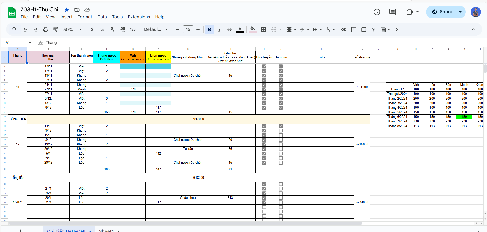
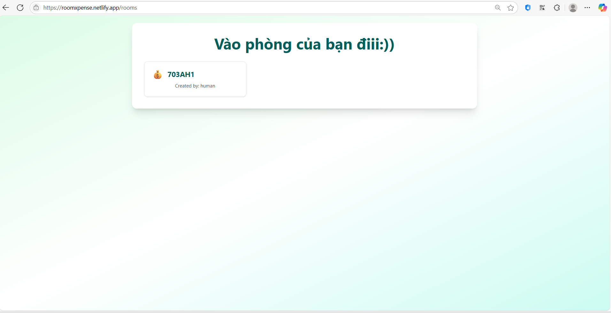
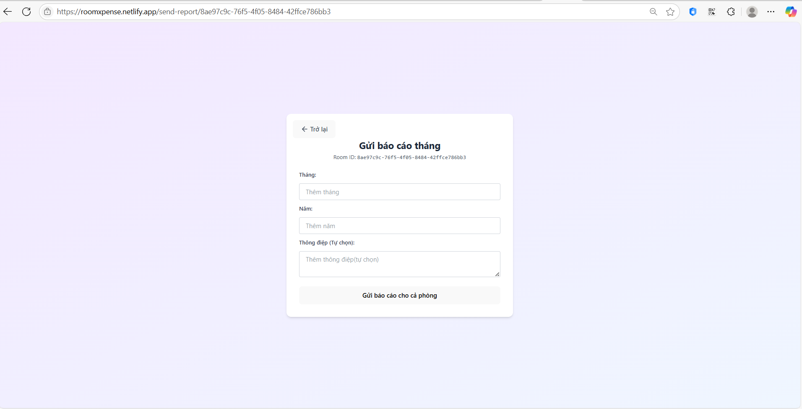
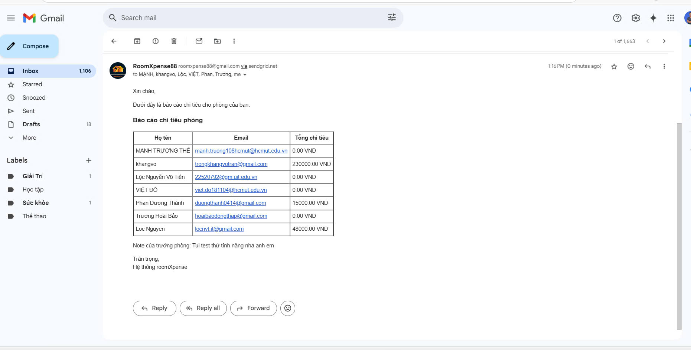
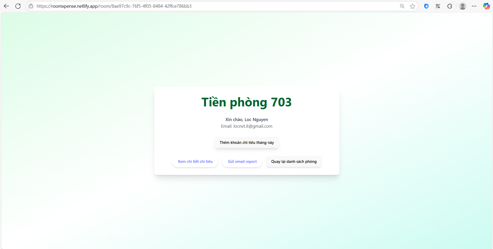
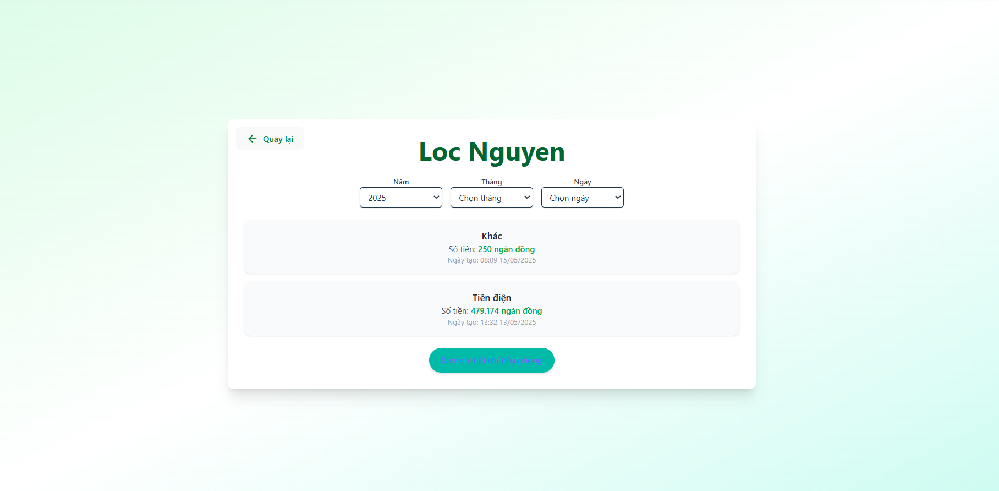

# 🖥️ roomUI

> _"Every month, we used to pass around the same crumpled notebook... names, numbers, confusion – and always, someone forgot to pay."_


In many student rooms, managing shared expenses still means scribbling on whiteboards, juggling receipts, or endlessly updating Excel files. It's **slow**, **prone to mistakes**, and worst of all – it **steals your time**.
## ❌ Before roomXepense:
- 📋 You tracked expenses with **manual sheets** – full of errors and disputes.
- 🧾 You had to **remind others** constantly – "Who paid for the last bill?"
- 📆 You wasted hours every month **figuring out who owes what**.

## ✅ After roomXpense:
- 🖥️ Everything is digital, transparent, and **real-time**.
- 📊 Every expense is logged and split **automatically**.
- 💡 No more confusion – just **clear records** and **happy roommates**.
---

## 💬 Hear It From Us
> _"We didn't just build a tool – we built **peace of mind** for student roommates."_

With **roomUI**, you spend less time managing money and more time living your best student life.  
Forget the spreadsheets. Forget the stress.  
**Join the new way of managing shared living.**
---

## 🚀 Key Features of roomUI

roomUI transforms how students manage shared living. Here’s what makes it powerful:

---

### 🔐 User Authentication
Secure login and registration for both students and administrators – ensuring access control and data protection.  


---

### 🏠 Room Management
Easily assign rooms, monitor room statuses, and manage members with intuitive tools.  


---

### 💸 Expense Tracking
Log shared expenses, automatically calculate contributions, and ensure fairness for everyone.  


---

### 📊 Reports & Insights
Generate monthly and yearly expenditure summaries with visual reports that make budgeting easy.  
  


---

### 📱 Responsive Design
roomUI is built to work seamlessly across **desktops**, **tablets**, and **mobile devices**.  


---

### 🔄 Real-time Updates
Get live updates on room assignments, member actions, and expense modifications – no more delays.  


---

✅ **Modern UI. Smart Features. Better Living.**  
Experience the future of student expense management with **roomUI**.

## 📁 Project Structure

```bash
roomUI/
│
├── api/               # API interactions with the backend system (e.g., roomXpenditure)
├── assets/            # Static files like images, icons, and other media
├── components/        # Reusable UI components (Buttons, Forms, etc.)
├── hooks/             # Custom React hooks for managing state and logic
├── pages/             # Pages of the app (Login, Dashboard, Room Details, etc.)
├── redux/             # Redux store, actions, and reducers for state management
│
├── App.css            # Global styling for the application
├── App.jsx            # Main component that defines the UI structure
├── index.css          # Basic styling and resets
└── main.jsx            # React entry point for the app

## 🛠️ Setup & Installation
1. Clone the Repository
``` bash
Copy
Edit
git clone https://github.com/iseT1enLoc/roomUI.git
cd roomUI
## 2. Install Dependencies
``` bash
npm install
## 3. Run the server
``` bash
npm run dev
```
### ✅ Short-Term Goals (1–2 Weeks)
- 🔒 Improve error handling and form validation on login & registration pages
- 🎨 Polish UI/UX design with consistent layout and theme colors
- 📦 Integrate Toast notifications for actions (e.g., login success, error alerts)
- 🧪 Add unit tests for core components using Jest & React Testing Library

## 🔗 Backend Repository
👉 **roomXpenditure Backend**: [https://github.com/iseT1enLoc/roomXpenditure](https://github.com/iseT1enLoc/roomXpenditure)

